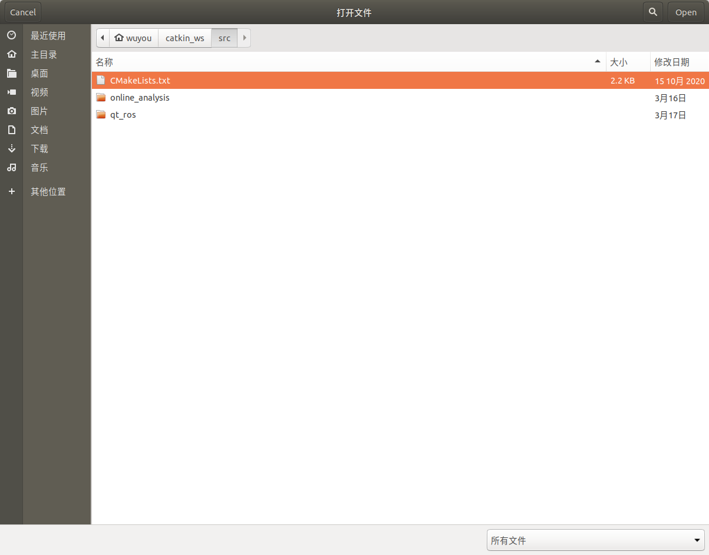
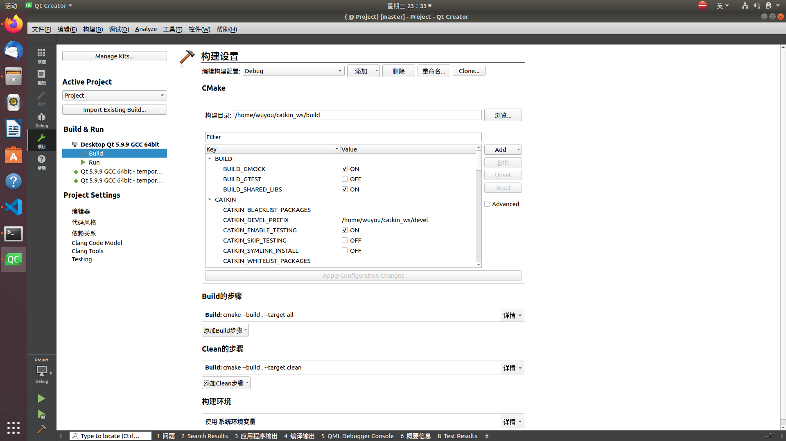
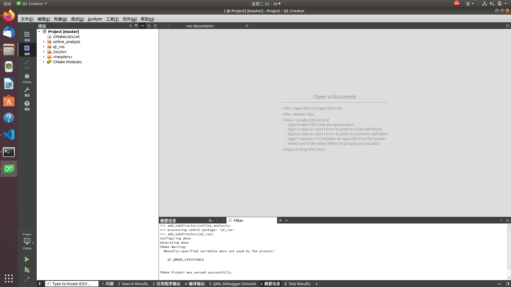

# BCI_ROS

## 2023.06.12

不再使用qt采集脑电信号，将C++ demo代码写成纯ROS C++类

本机ubuntu版本 20.04

## 工控机配置指南

ubuntu版本 18.04

ros版本 melodic

Qt版本 5.9.9

## Qt与ROS混合编程

参考文档：

[ROS Qt5 librviz人机交互界面开发一（配置QT环境）](https://blog.csdn.net/qq_38441692/article/details/105158790)

在终端运行qtcreator

文件->打开项目->选择工作空间下的cmakelist.txt

打开后点击项目，将build的构建目录改为当前工作空间的build文件夹

然后构建->执行cmake

最后点击编辑，出现下图所示即打开成功

## 节点运行顺序

首先运行相机配置launch文件：

`roslaunch realsense2_camera rs_aligned_depth.launch`

接着运行数据发送与分析节点：

`roslaunch online_analysis ana_simu.launch`

最后运行相机节点：

`rosrun bci_grip col_align_depth.cpp`
